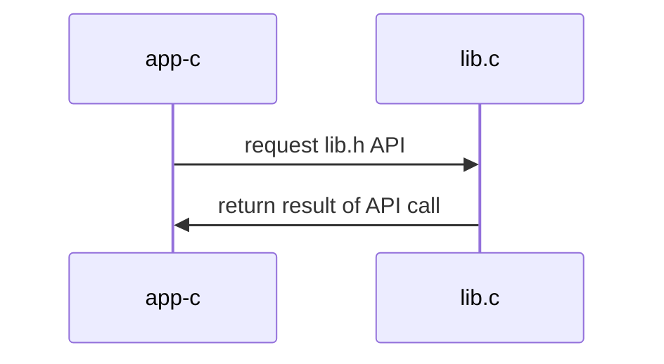

# nanodt: Nano Distributed Table (v2.0)

## Initial non-distributed service


### Compile 

```
$ cd centralized
$ make
gcc -g -Wall -c app-c.c
gcc -g -Wall -c lib.c
gcc -g -Wall app-c.o lib.o  -o app-c
```


### Execute 

```
$ ./app-c
set("nombre", 1, 0x123)
get("nombre", 1) -> 0x123
```


### Arquitecture



