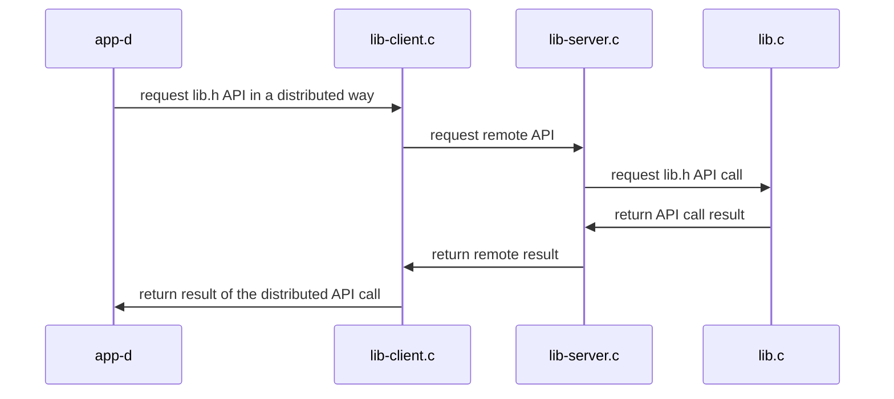

# nanodt: Nano Distributed Table (v2.0)

## Distributed service based on mqueue (POSIX queue)


### Compile 

```
$ cd distributed-mqueue
$ make
gcc -g -Wall -c app-d.c
gcc -g -Wall -c lib-client.c
gcc -g -Wall -c lib.c
gcc -g -Wall -lrt app-d.o lib.o lib-client.o       -o app-d  -lrt
gcc -g -Wall -c lib-server.c
gcc -g -Wall            lib.o lib-client.o lib-server.o  -o lib-server  -lrt
```


### Execute 

*TIP: POSIX queues are used for communicating processes in the same machine*

<html>
<table>
<tr><th>Step</th><th>Client</th><th>Server</th></tr>
<tr>
<td>1</td>
<td></td>
<td>
 
```
$ ./lib-server
```
 
</td>
</tr>

<tr>
<td>2</td>
<td>

```
$ ./app-d
d_set("nombre", 1, 0x123)
d_get("nombre", 1) -> 0x123
```

</td>
<td>
 
```

 1 = init(nombre, 10);
 1 = set(nombre, 1, 0x123);
 1 = get(nombre, 1, 0x123);
```
 
</td>
</tr>

<tr>
<td>3</td>
<td></td>
<td>

```
^Caccept: Interrupted system call
```

</td>
</tr>
</table>
</html>


*TIP: POSIX queues can be visible from command line:

``` bash
sudo mkdir /dev/mqueue
sudo mount -t mqueue none /dev/mqueue
ls -las /dev/mqueue
```


### Arquitecture 



